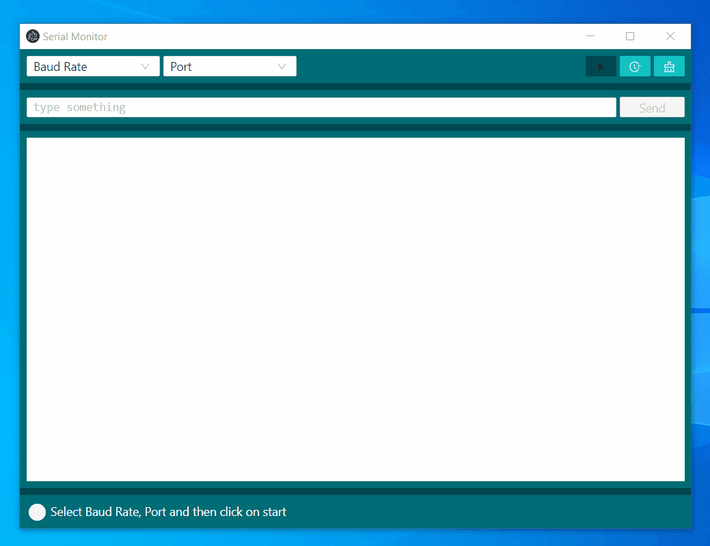

# Serial monitor

|Download version|
| --- |
|[v0.0.1](installer/SerialmonitorSetup0.0.1.exe)|

With Serial monitor you can read messages coming from the serial port. You can use it with Arduino, microPython, espruino or any device capable of communicating via serial protocol.

To start, connect the device to a free USB port on your PC. Make sure you have the device drivers correctly installed and launch Serial Monitor

